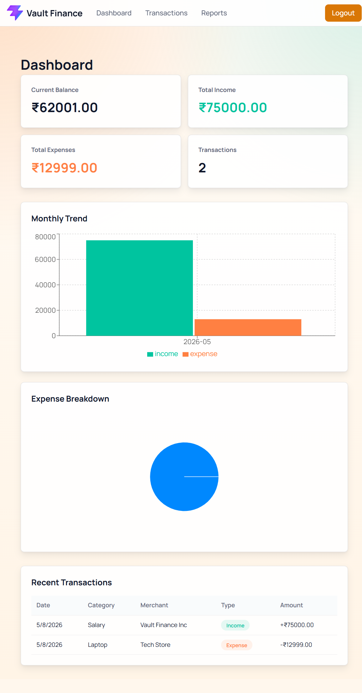
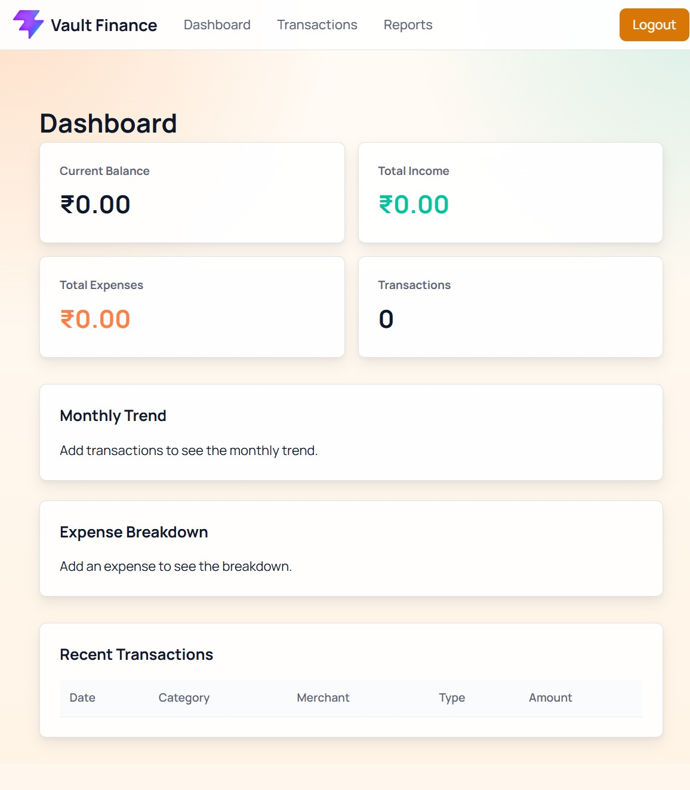
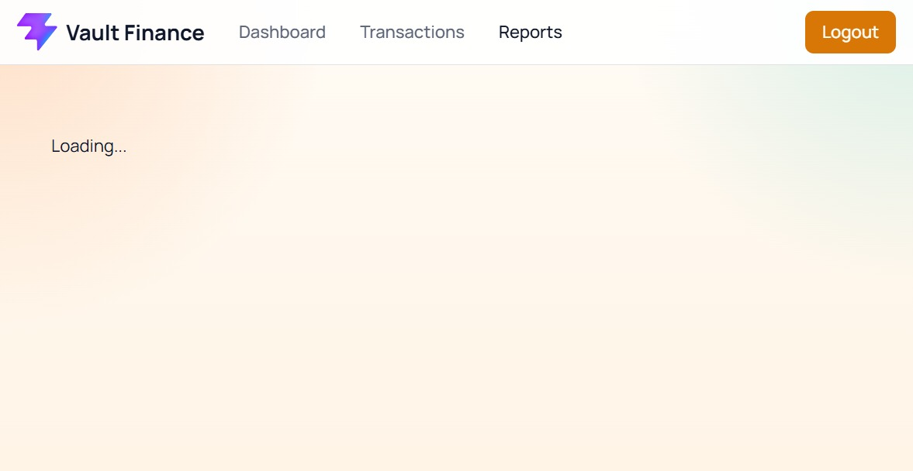

# Vault Finance Dashboard

Vault Finance is a frontend-only finance dashboard built with React + TypeScript. The project focuses on clean UI design, interactive behavior, role-based frontend simulation, and thoughtful state management without relying on a backend.

## Demo Links

- Repository: https://github.com/gandharr/Vault-Finance
- Deployment: https://gandharr.github.io/Vault-Finance/

## Screenshots

### Desktop View



### Mobile View

<div style="display: flex; gap: 20px; justify-content: center; flex-wrap: wrap;">
  
  
</div>

## Assignment Context

This submission is intentionally designed to match the brief:

- Frontend-only implementation
- Mock/static data support
- Simulated role behavior on UI
- Focus on UX, structure, and interaction quality rather than production backend logic

## Key Features

- Dashboard overview with total balance, income, and expense summary cards
- Time-based balance trend chart with hover point details
- Categorical spending breakdown visualization
- Interactive transaction section with search, filters, sorting, and role-aware actions
- Simulated Viewer/Admin modes with Admin access gate via sign-in modal
- Insights section covering highest spending category, monthly comparison, and observations
- Theme switching (light/dark)
- Workspace settings including demo reset and password reset flow simulation
- Local persistence with localStorage
- Empty-state handling and responsive behavior
- Subtle motion and transition polish

## Tech Stack

- React 19
- TypeScript
- Vite
- Plain CSS (custom system, no UI component library)
- localStorage for persistence

## Project Structure

- src/App.tsx: application UI, state, role logic, transaction operations, chart utilities
- src/App.css: visual system, responsive layout, motion, component-level styling
- src/index.css: theme variables, base styles, typography, global surface/background definitions
- public/: static assets (favicon/icons)
- public/screenshots/: README screenshots for desktop and mobile preview

## Setup and Run

Install dependencies:

```bash
npm install
```

Start local development server:

```bash
npm run dev
```

Create production build:

```bash
npm run build
```

Run linting:

```bash
npm run lint
```

Preview production build locally:

```bash
npm run preview
```

## Deployment (GitHub Pages)

- Live URL: https://gandharr.github.io/Vault-Finance/
- Deployment is automated through GitHub Actions on every push to `main`
- Workflow file: `.github/workflows/deploy-pages.yml`
- Vite base path is configured in `vite.config.ts` as `/Vault-Finance/` for project-site routing

If the site does not update immediately after pushing, check the Actions tab in GitHub and wait a few minutes for the workflow to complete.

## Functional Walkthrough

1. Header and Access
- Role selector allows Viewer/Admin switch for demo purposes
- Admin mode is gated by sign-in interaction
- Sign-up/login modal is frontend simulated and state driven

2. Financial Summary
- Total balance is derived from opening balance + income - expenses
- Income and expense cards display current totals in INR format
- Hero sparkline shows balance movement and month-over-month delta

3. Charts and Insights
- Balance trend chart displays monthly trajectory with hover details
- Spending breakdown chart highlights category-wise expense share
- Insights section summarizes key observations from current dataset

4. Transactions
- View transaction details: date, merchant, category, type, amount, note
- Search by merchant/category/note
- Filter by type and category
- Sort by newest/oldest/amount high/amount low
- Admin can add/edit/delete transactions; Viewer is read-only

## Requirement-by-Requirement Mapping

1. Dashboard Overview: Implemented
- Summary cards: Total Balance, Income, Expenses
- Time-based visualization: Balance trend chart
- Categorical visualization: Spending breakdown

2. Transactions Section: Implemented
- Transaction fields displayed: Date, Amount, Category, Type, Merchant, Note
- Interactive features: search, filtering, sorting

3. Basic Role-Based UI: Implemented
- Viewer: read-only mode
- Admin: add/edit/delete enabled
- Role switch demonstrated directly in UI

4. Insights Section: Implemented
- Highest spending category insight
- Monthly comparison insight
- Derived observation message

5. State Management: Implemented
- Core state managed via useState
- Derived values optimized with useMemo
- Persistence and side effects handled with useEffect
- Covers: transactions, filters, role, auth modal state, theme, settings state

6. UI/UX Expectations: Implemented
- Clean dashboard layout and consistent typography/spacing
- Responsive behavior across desktop/tablet/mobile
- Empty-state handling for filtered/no-data conditions
- Interaction and transition polish for smoother UX

## Optional Enhancements Included

- Dark mode / light mode toggle
- localStorage persistence
- Authentication flow simulation (login/signup/reset)
- UI transitions and animated entry states
- Additional panel micro-insights and trend metadata

## Design and UX Decisions

- Kept information hierarchy explicit: summary first, trends second, operations after
- Used concise labels and tight spacing to keep content scan-friendly
- Preserved readability in dark surfaces with clear contrast and muted secondary text
- Added progressive interaction polish while respecting reduced-motion preferences

## Data and Logic Notes

- Currency formatting uses INR locale behavior
- Transaction amount input supports comma-formatted numeric entry
- Chart points and summary cards are derived from live in-memory transaction state
- Role behavior is intentionally simulated for frontend evaluation scope

## Assumptions

- Backend/API integration is out-of-scope for this assignment
- Auth is simulated for UI and flow demonstration
- No production security guarantees are claimed in this frontend-only version

## Quick QA Pass (Current Status)

- npm run lint: pass
- npm run build: pass
- Viewer/Admin flow: verified
- Admin add/edit/delete transaction operations: verified
- Search/filter/sort interactions: verified
- Charts render with current dataset and hover labels: verified
- Empty states: verified
- Responsive behavior (desktop/tablet/mobile): verified

## What I Would Do Next in Production

- Replace simulated auth with backend authentication and role authorization
- Move transactions to persistent API/database
- Add automated tests (unit + integration + e2e)
- Add secure validation and error handling across request boundaries
- Add telemetry and monitoring for runtime health
